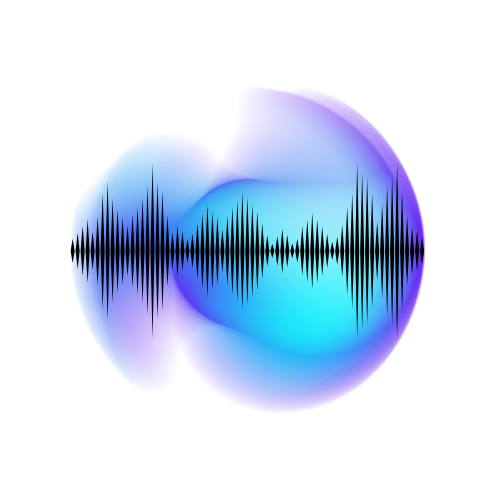

# **SynthWave: Gestenbasierter Synthesizer mit Oszilloskop**



**SynthWave** ist eine React-Anwendung, die mit TypeScript entwickelt wurde und die Bibliotheken p5.js und ml5.js integriert. Sie ermöglicht die Erkennung von Handgesten über die Webcam zur Steuerung eines Synthesizers. Ein Oszilloskop visualisiert die erzeugten Klänge in Echtzeit.

## Inhaltsverzeichnis

- [**SynthWave: Gestenbasierter Synthesizer mit Oszilloskop**](#synthwave-gestenbasierter-synthesizer-mit-oszilloskop)
  - [Inhaltsverzeichnis](#inhaltsverzeichnis)
  - [Installation](#installation)
  - [Verwendung](#verwendung)
  - [Projektstruktur](#projektstruktur)
  - [Abhängigkeiten](#abhängigkeiten)
  - [Mitwirkende](#mitwirkende)
  - [Danksagungen](#danksagungen)

## Installation

Stellen Sie sicher, dass Node.js (Version 20.15.1 oder höher) und Yarn (Version 4.3.1 oder höher) auf Ihrem System installiert sind.

1. **Repository klonen:**

   ```bash
   git clone https://github.com/IhrBenutzername/synthwave.git
   cd synthwave
   ```

2. **Abhängigkeiten installieren:**

   ```bash
   yarn install
   ```

## Verwendung

1. **Entwicklungsserver starten:**

   ```bash
   yarn dev
   ```

2. **Anwendung im Browser öffnen:**

   Öffnen Sie Ihren Browser und navigieren Sie zu `http://localhost:5173`.

3. **Webcam-Zugriff erlauben:**

   Beim ersten Start wird die Anwendung um Zugriff auf Ihre Webcam bitten. Erlauben Sie den Zugriff, um die Gestenerkennung zu aktivieren.

## Projektstruktur

Die wichtigsten Dateien und Verzeichnisse sind:

- `src/`
  - `App.tsx`: Hauptkomponente der Anwendung mit der Implementierung des Synthesizers und des Oszilloskops.
  - `index.tsx`: Einstiegspunkt der React-Anwendung.
- `public/`
  - `index.html`: Haupt-HTML-Datei der Anwendung.

## Abhängigkeiten

Die Anwendung verwendet folgende Hauptbibliotheken:

- [React](https://reactjs.org/): JavaScript-Bibliothek für Benutzeroberflächen.
- [TypeScript](https://www.typescriptlang.org/): Typsicheres JavaScript.
- [p5.js](https://p5js.org/): Bibliothek für kreative Programmierung.
- [ml5.js](https://ml5js.org/): Einfach zu verwendende Machine-Learning-Bibliothek für den Webbrowser.

## Mitwirkende

- **Fessler Tobi** - [GitHub-Profil des Mitwirkenden](https://github.com/TobiFessler)

## Danksagungen

Dieses Projekt wurde inspiriert von den Möglichkeiten, die p5.js und ml5.js bieten, um kreative Anwendungen mit Gestenerkennung und Echtzeit-Audio zu entwickeln. Besonderer Dank gilt den Entwicklern dieser Bibliotheken für ihre Arbeit.